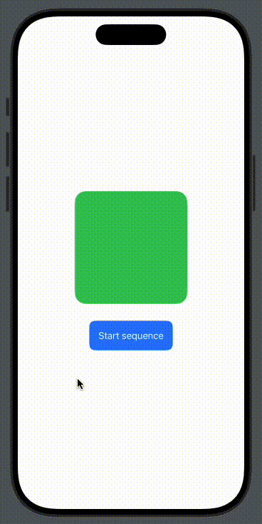
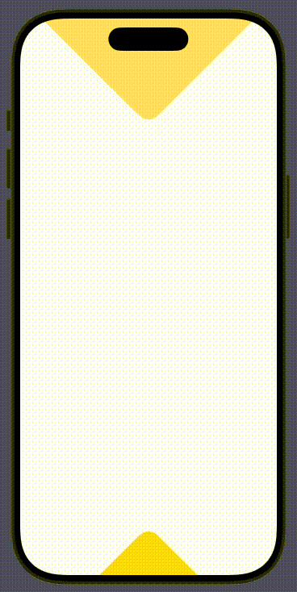

# AnimationSequence

SwiftUI tool that allows building animation sequences more easily by hiding dispath queues details complexity.

## Platforms
- iOS(.v13)
- tvOS(.v13)
- watchOS(.v6)
- macOS(.v11)

## What's in the box
- `AnimationSequence.swift`
- `AnimationConfiguration.swift`
- `AnimationEasing`
- `AnimationDefaults`

## Swift Package Manager
Add the Swift package to your Package.swift file:

```swift
dependencies: [
    .package(url: "https://github.com/cristhianleonli/AnimationSequence.git", .upToNextMajor(from: "0.0.1"))
]
```

## Demo

| Example 1 | Example 2 |
|-----------------|-------------|
|  |  |

## Usage

`AnimationSequence` is meant to be flexible enough to allow you write more readable animations. Here you have a few examples of what it looks like to write animation sequences. Since almost all parameters are optional, and default to nil, it will let you write animation blocks faster.

### Default values
AnimationSequence init function takes optional arguments, they will default to `AnimationDefaults`.
In this example, two animation blocks are added to the sequence, and the start function is called at the end.

```swift
// takes the default values and applies it to all animations in the chain
AnimationSequence()
    .add {
        state.offsetX = 10
        state.color = .red
    }
    .add {
        state = AnimationState()
    }
    .start()
```

### Common values
When creating an instance of AnimationSequence with parameters, those will be applied to all animations in the sequence that don't have specific values.

```swift
// Set values for all animations in the chain
AnimationSequence(delay: 0, duration: 0.5, easing: .default)
    .add {
        state.offsetX = 10
        state.color = .red
    }
    .add {
        state = AnimationState()
    }
    .start()
```

A handy function `commonConfig()` is also available, to set the common animation values at any time in the sequence. The place where this function is called **does** matter, since from that point onwards, all new animations added to the sequence will be affected.

```swift
AnimationSequence()
    .add {
        // ...
    }
    .commonConfig(delay: 0, duration: 0.5, easing: .default)
    // config is applied from this point on
    .add {
        // ...
    }
    .start()
```

### Specific values
In this sequence, animations have specific values, which will overwrite the global values.
Any non-given value will be default to globals or fallback to `AnimationDefaults` otherwise.

```swift
AnimationSequence()
    // only this animation will have duration of 0.5
    .add(duration: 0.5) {
        state.offsetX = 10
        state.color = .red
    }
    // only this animation will have delay of 0.3
    .add(delay: 0.3) {
        state = AnimationState()
    }
    .start()
```

### Async
Adding animations will always keep them one after the other, but in case you need an animation to be triggered but not awaited, `async` is the solution. Let's picture the animation sequence as follows:
```swift
 (A)==>(B)==|------|==>(E)==>(end)
            |==>(C)
            |==>(D)

// Animation A starts, A finishes, B starts, B finishes,
// C, and D are triggered, E starts and finishes the sequence.
// C, and D will eventually conclude, but wont be awaited. 
```

```swift
AnimationSequence()
    .add(label: "A") {
        state.offsetX = 10
        state.color = .red
    }
    .add(label: "B") {
        state.color = .blue
    }
    .async(label: "C") {
        state.scale = 1.5
    }
    .async(label: "D", duration: 0.4) {
        state.opacity = 0.5
    }
    .add(label: "E") {
        state = AnimationState()
    }
    .start()
```

### Wait
Sometimes a small waiting time is needed for your animations, but don't want to tweak the next block's delay. For that, there's the `wait()` function that simplifies the process.

```swift
AnimationSequence()
    .add {
        state.offsetX = 10
        state.color = .red
    }
    // using this function is better than adding
    // an empty animation block, since wait() will add the delay
    // to the next block, instead of triggering a new empty animation block
    .wait(for: 0.2)
    .add {
        state = AnimationState()
    }
    .start()
```

### Debug
To bring more transparency on what's going on with our animations, there is a `debug()` function that enables a flag to print whenever an animation is dispatched, the onFinish callback, and a few more details.

```swift
AnimationSequence()
    .debug()
    .start()
```

## Contribution

If you find the project interesting, catch any mistakes I've made, or just see any room for improvement, feel free to fork and contribute, I'll be more than happy.
